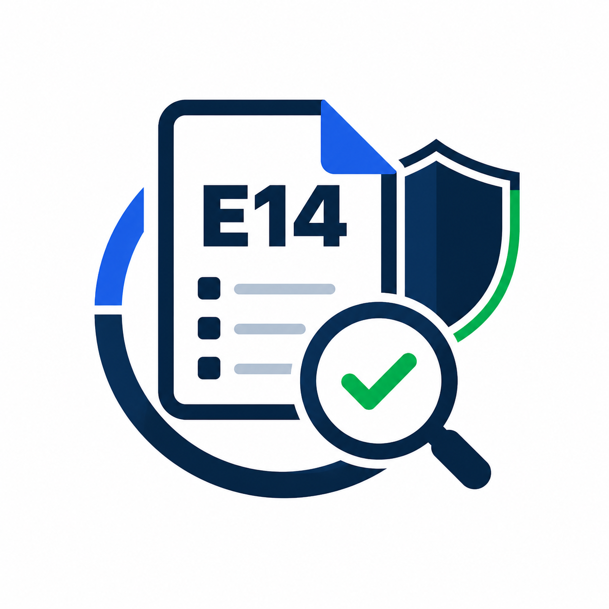

<div align="center">
  
  <h1>Auditoria E14</h1>
  <p><b>Inventario, descarga, auditoria de metadatos y OCR local para formularios E14</b></p>

  <p>
    <a href="https://nodejs.org/" target="_blank" rel="noopener noreferrer">
      
    </a>
    <a href="https://www.electronjs.org/" target="_blank" rel="noopener noreferrer">
      
    </a>
    <a href="https://pnpm.io/" target="_blank" rel="noopener noreferrer">
      
    </a>
    <a href="https://exiftool.org/" target="_blank" rel="noopener noreferrer">
      
    </a>
    <a href="https://github.com/xenova/transformers.js" target="_blank" rel="noopener noreferrer">
      
    </a>
    <a href="https://opensource.org/license/mit" target="_blank" rel="noopener noreferrer">
      
    </a>
  </p>
</div>

---

**Auditoria E14** es una aplicacion local para inventariar, descargar y auditar formularios E14 publicados por la Registraduria.

La app usa los JSON y PDFs del sitio publico, calcula hashes SHA-256, extrae metadata con `pdf-lib` y `ExifTool`, permite revisar los resultados en una interfaz web o de escritorio con Electron, y puede ejecutar OCR local para extraer votos desde PDFs ya descargados.

Fuente por defecto:

```text
https://e14segundavueltapresidente.registraduria.gov.co/home
```

---

## Descargas

Los instaladores y ejecutables son generados automaticamente por el pipeline de GitHub Actions en cada version.

| Sistema Operativo | Formato | Enlace de Descarga |
| :-- | :-- | :-- |
|  **macOS** | `.dmg` | [Descargar para macOS](https://github.com/Caxvalencia/audit-e14/releases/latest/download/Auditoria.E14-mac.dmg) |
|  **Windows** | `.exe` | [Descargar para Windows](https://github.com/Caxvalencia/audit-e14/releases/latest/download/Auditoria.E14.Setup.exe) |
|  **Linux AppImage** | `.AppImage` | [Descargar AppImage](https://github.com/Caxvalencia/audit-e14/releases/latest/download/Auditoria.E14.AppImage) |
|  **Linux Deb/Ubuntu** | `.deb` | [Descargar .deb](https://github.com/Caxvalencia/audit-e14/releases/latest/download/audit-e-14_amd64.deb) |

> [!NOTE]
> Puedes encontrar todos los compilados y versiones previas en la seccion de [Releases de GitHub](https://github.com/Caxvalencia/audit-e14/releases).

> [!WARNING]
> **Para usuarios de macOS (Gatekeeper / Quarantine):**
> Al abrir la aplicacion en macOS, es posible que el sistema muestre una alerta indicando que _"la aplicacion esta danada y no puede abrirse"_. Esto es un mecanismo de seguridad estandar de macOS porque el binario de GitHub Actions se compila sin firma digital de desarrollador Apple.
>
> Para solucionarlo, ejecuta este comando despues de arrastrar la app a la carpeta de _Aplicaciones_:
>
> ```bash
> xattr -cr "/Applications/Auditoria E14.app"
> ```

## Documentacion

- [Guia de uso](docs/guia-uso.md): instalacion local, interfaz, filtros, limite, hilos, salidas, metadata y CLI.
- [Arquitectura](docs/arquitectura.md): endpoints, construccion de rutas PDF, API local, cancelacion y validaciones.

## Inicio rapido

Desde esta carpeta:

```bash
pnpm install
pnpm start
```

Abrir:

```text
http://localhost:4173
```

Para cambiar el puerto:

```bash
PORT=5000 pnpm start
```

## Aplicacion de escritorio

La app tambien puede ejecutarse con Electron. Usa el mismo motor local de inventario, descarga y auditoria, pero abre una ventana de escritorio y permite seleccionar la carpeta de salida con un dialogo nativo.

Modo desarrollo:

```bash
pnpm run desktop
```

Build local sin instalador:

```bash
pnpm run pack
```

Distribuible:

```bash
pnpm run dist
```

La build queda en `dist/`, que esta excluida de Git.

## Uso recomendado

1. Seleccionar departamento, municipio, zona y puesto.
2. Abrir `Configuracion`.
3. Usar `Limite = 3` para una prueba rapida.
4. Mantener `Hilos = 4` para una concurrencia moderada.
5. Revisar `Carpeta salida`, `Omitir existentes`, `Metadatos` y `URL base`.
6. Hacer clic en `Cargar base de datos`.
7. Hacer clic en `Descargar y auditar`.
8. Revisar tabla, progreso, hash SHA-256 y metadata completa del PDF en el panel de detalle.

Durante una descarga aparece `Cancelar descarga`.

## CLI

Inventario filtrado:

```bash
node scripts/e14-audit.mjs inventory --department 60 --municipality 010 --zone 00 --stand 00
```

Descarga y auditoria:

```bash
node scripts/e14-audit.mjs download --department 60 --municipality 010 --zone 00 --stand 00 --limit 3
```

Extraccion OCR de votos desde PDFs locales ya descargados:

```bash
node scripts/e14-audit.mjs ocr --department 60 --municipality 010 --zone 00 --stand 00 --limit 3
```

OCR con modelo local ONNX para digitos manuscritos:

```bash
node scripts/e14-audit.mjs ocr --department 60 --municipality 010 --zone 00 --stand 00 --limit 3 --ocr-provider transformers --ocr-model mnist.onnx
```

Si ya tienes un modelo ONNX compatible descargado/local:

```bash
E14_OCR_LOCAL_MODEL_PATH=/ruta/a/models node scripts/e14-audit.mjs ocr --ocr-provider transformers --ocr-model nombre-o-ruta-modelo --ocr-local-only
```

Guardar imagenes de depuracion OCR:

```bash
node scripts/e14-audit.mjs ocr --department 60 --municipality 010 --zone 00 --stand 00 --limit 3 --keep-ocr-images
```

Fuente personalizada:

```bash
node scripts/e14-audit.mjs inventory --base-url https://nuevo-dominio.example
```

## Salidas

Por defecto escribe en `output/e14`:

- `raw/*.json`: cache de JSON fuente.
- `inventory.csv`: inventario plano.
- `inventory.jsonl`: inventario en JSON Lines.
- `audit.jsonl`: resultado por PDF, hash y metadata.
- `ocr-results.csv`: votos OCR por mesa, consistencia y revision requerida.
- `ocr-zone-summary.csv`: agregados OCR solo con mesas consistentes.
- `ocr-debug/...`: imagen renderizada y recortes OCR cuando se activa depuracion.
- `pdf/...`: PDFs descargados.

`output/` esta excluido en `.gitignore`.
